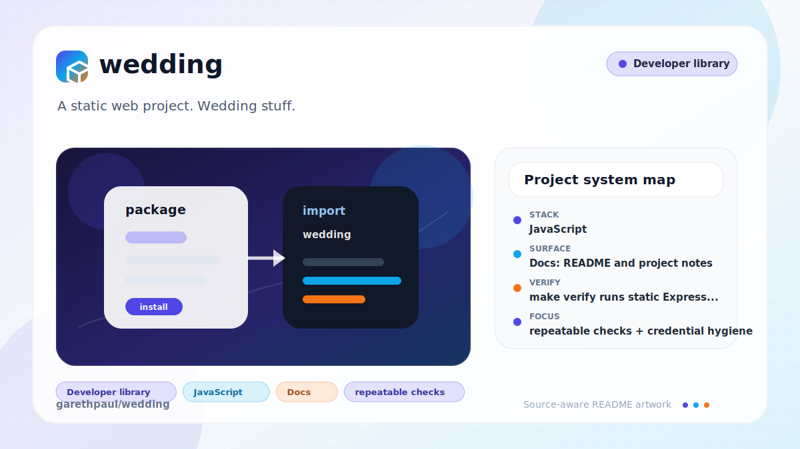

# wedding

<!-- README-OVERVIEW-IMAGE -->


## Overview

`garethpaul/wedding` is a static web project. Wedding stuff.

This README is based on the checked-in source, manifests, scripts, and repository metadata on the `master` branch. The project language mix found during review was: JavaScript (3).

## Repository Contents

- `README.md` - project overview and local usage notes
- `app` - source or example code
- `SECURITY.md` - security reporting and disclosure guidance
- `VISION.md` - project direction and maintenance guardrails

Additional scan context:

- Source directories: app
- Dependency and build manifests: none detected
- Entry points or build surfaces: none detected
- Test-looking files: app/spec.js

## Getting Started

### Prerequisites

- Git
- Node.js 20 or newer and npm

### Setup

```bash
git clone https://github.com/garethpaul/wedding.git
cd wedding
npm ci --prefix app
```

The lockfile provides reproducible installs for local verification and CI.

## Running or Using the Project

- Run `npm --prefix app start` from the repository root, or `npm start` from `app/`.

## Testing and Verification

- `make verify` runs static Express route/header checks, including browser
  security, download protection, obsolete XSS-auditor disabling, modern
  cross-origin isolation, and referrer policy
  headers, DNS prefetch control, one-year HSTS max-age, Content Security Policy
  coverage, and the npm test suite when `app/node_modules` is installed. CSP
  coverage includes the `form-action 'self'` directive. Template checks also
  enforce document language, mobile viewport metadata, and alternative text for
  every active image.
- `make check` runs the same verification gate.
- `node scripts/check_wedding_contracts.js` runs just the dependency-free route contracts.
- Completed maintenance plans live under `docs/plans` and are checked by
  `make check`.
- `npm --prefix app test` runs the Node.js/Supertest suite after dependencies
  are installed.
- `npm audit --prefix app` verifies the locked dependency graph has no known
  vulnerabilities.

GitHub Actions runs the same gate on fixed Ubuntu 24.04 runners for Node.js 20,
22, and 24. Concurrent runs for the same branch are cancelled when superseded.

## Deployment Status

The repository does not contain an active deployment workflow. The retired
Travis pipeline and its encrypted Google Cloud credential archive were removed;
GitHub Actions verifies the site but does not deploy it. App Engine metadata is
retained only as historical application configuration. Any future deployment
must use a newly provisioned identity stored outside Git, with least privilege
and an explicit reviewed workflow.

When the required SDK or runtime is unavailable, use static checks and source review first, then verify on a machine that has the matching platform toolchain.

## Configuration and Secrets

- Detected references to Mapbox, Twitter. Keep API keys, OAuth credentials, tokens, and account-specific values in local configuration only.
- The removed encrypted archive remains in Git history. Repository cleanup does
  not prove the historical Google Cloud key or Travis variables were revoked;
  the owner must retire or rotate them through the providers.

## Security and Privacy Notes

- Review changes touching authentication, credentials, network requests, or
  deployment automation. The maintained tree must not restore Travis decrypt
  commands, service-account JSON, or encrypted credential containers.
- Review changes touching shell execution, subprocess, or dynamic evaluation; examples from the scan include app/public/js/less.js.
- Review changes touching infrastructure, proxy, cloud, or deployment configuration; examples from the scan include app/public/js/less.js.
- Keep site-owned executable scripts local and same-origin. Templates must not
  contain inline scripts, analytics loaders, or executable registry widgets;
  legacy library scripts remain limited to explicit CSP CDN origins.

## Maintenance Notes

- See `docs/plans/2026-06-13-wedding-permissions-policy.md` for the
  least-privilege browser capability policy on pages and static assets.

- See `SECURITY.md` for vulnerability reporting and safe research guidance.
- See `VISION.md` for project direction and contribution guardrails.
- See `docs/plans/2026-06-08-wedding-express-hardening.md` for the current
  Express hardening baseline.
- See `docs/plans/2026-06-08-wedding-tokenless-map.md` for the tokenless map
  embed contract.
- See `docs/plans/2026-06-08-wedding-powered-by-header.md` for the Express
  implementation header contract.
- See `docs/plans/2026-06-09-wedding-browser-headers.md` for frameguard and
  no-sniff browser header coverage.
- See `docs/plans/2026-06-09-wedding-referrer-policy.md` for site-wide
  referrer-policy coverage.
- See `docs/plans/2026-06-09-wedding-download-options.md` for static asset
  download-protection coverage.
- See `docs/plans/2026-06-09-wedding-xss-protection.md` for the historical
  `X-XSS-Protection` header decision.
- See `docs/plans/2026-06-09-wedding-dns-prefetch-control.md` for DNS prefetch
  control coverage.
- See `docs/plans/2026-06-09-wedding-content-security-policy.md` for the
  site-wide Content Security Policy baseline.
- See `docs/plans/2026-06-09-wedding-form-action-policy.md` for the CSP
  form-action submission boundary.
- See `docs/plans/2026-06-09-wedding-hsts-max-age.md` for the one-year HSTS
  max-age contract.
- See `docs/plans/2026-06-10-wedding-node-modernization.md` for the maintained
  Node.js, template engine, dependency, and hosted CI baseline.
- See `docs/plans/2026-06-10-wedding-inline-script-removal.md` for the strict
  script policy, tracking removal, and local initialization contract.
- See `docs/plans/2026-06-10-wedding-image-accessibility.md` for document
  metadata and image alternative-text coverage.

## Contributing

Keep changes small and tied to the project that is already present in this repository. For code changes, document the toolchain used, avoid committing generated dependency directories or local configuration, and update this README when setup or verification steps change.
